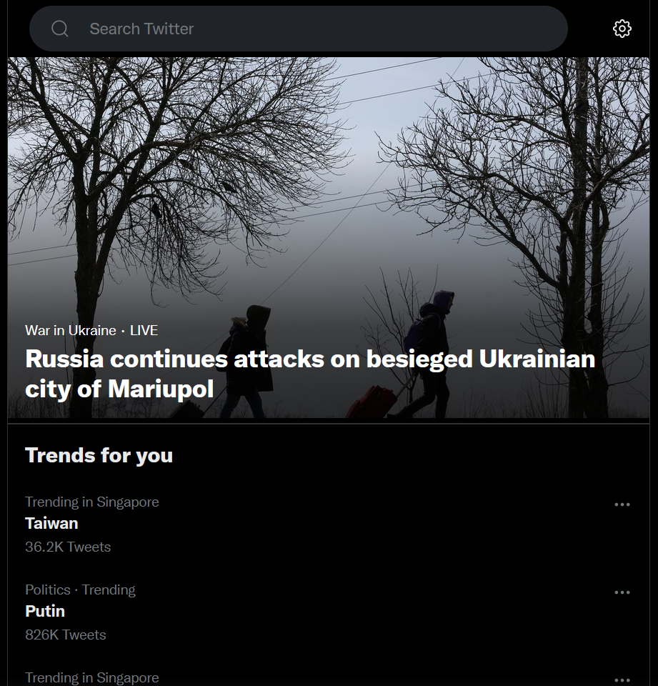
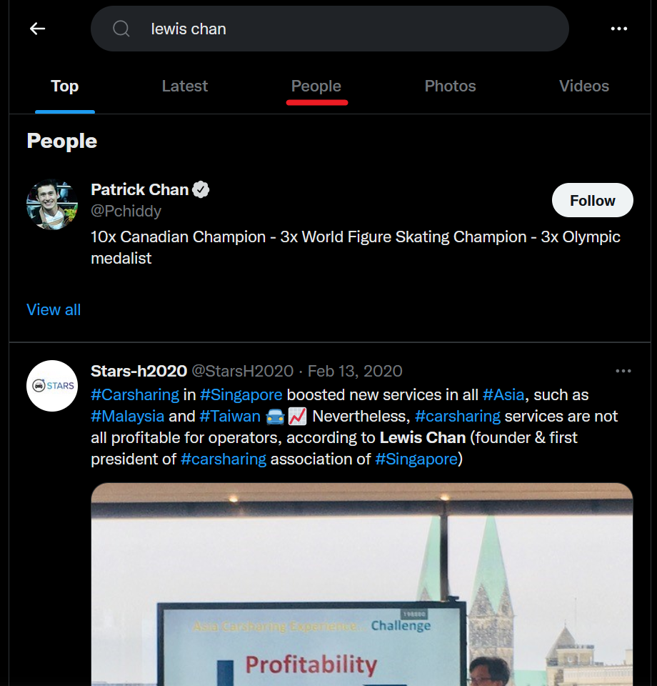
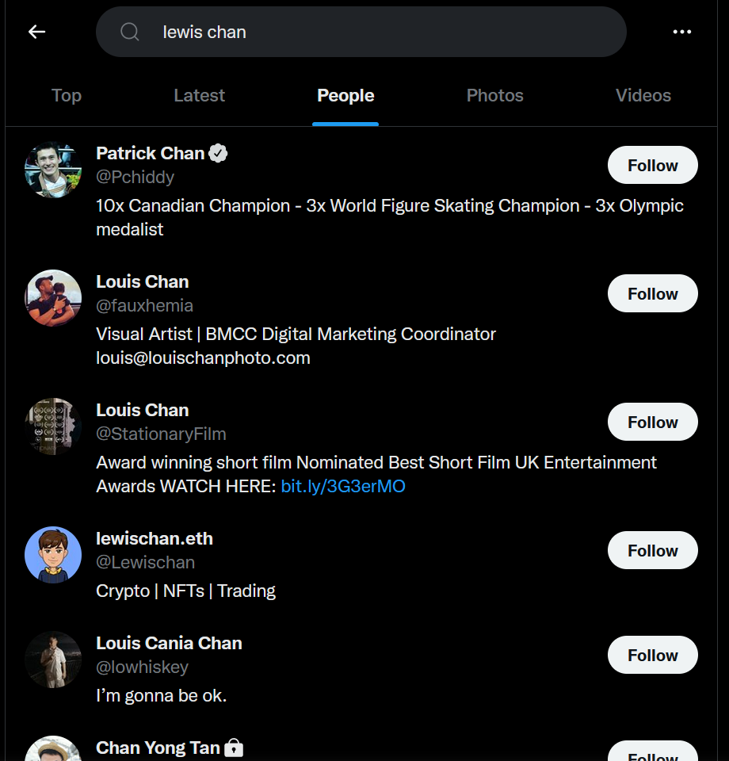
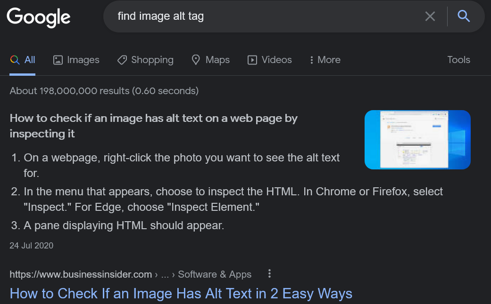

# Beginning of a Journey

> Welcome to OSINT! The challenges in this category will enable you to learn more about OSINT, and reflect on your internet activity traces.

> Here's your first challenge. One of our friends, Lewis, is a Computer Science student at SMU School of Computing and Information Systems who is majoring in cybersecurity. Unfortunately, we haven't heard from him in a couple of weeks.

> Let's see if we can find something on his Twitter account. Not really sure what is his username though. But I do recall his full name is Lewis Chan and that his birthday is on the 6th of January. Oh, and he really hates cryptocurrency. I think he said that it is a Ponzi scheme or something.

> Note: Making any contact with any individuals is out of the scope of this challenge. You wouldn't want to alert someone that you're investigating them right?

## Information Gathered

First, let's take stock of the information provided.

* Name: Lewis Chan
* School: SMU School of Computing and Information Systems (Computer Science, Cybersecurity Major)
* Social Media: Twitter
* Birthday: 6 January
* Hates cryptocurrency

The easiest way to start would be to find Lewis' Twitter account.

## Searching Twitter
Google, even advanced search, would not return any desired results.

Thankfully, Twitter has its own search function. If you don't want to sign up for a Twitter account, you can easily find the link to its search function (https://twitter.com/explore).



However, it may not be immediately obvious where you can find THE Lewis.

To search only accounts and exclude posts, switch to the "People" tab.




With a bit of scrolling, we can already find quite a few Lewis Chan-s.


Now, consider the other information which we have.

He hates crypto, so he can't be @Lewischan.

@lewischan0601 is also an SMU student, likes cybersecurity, and insists that "Crypto" is cryptography not cryptocurrency. Definitely likely to be THE Lewis Chan.


Birthday matches too, definitely correct.

Next course of action would be to look at his tweets.


Um...


I agree. Also, could this be a hint?

Let's see if Lewis has uploaded any images.


Where is the alt tag? Even if you have zero web experience, remember, Google is your best friend.




Let's go back to Lewis' Twitter.


There you go! The flag is in the alt tag in the img element.

**FLAG:** ```WH2022{s0c1al_m3d14_4dv3ntur35}```