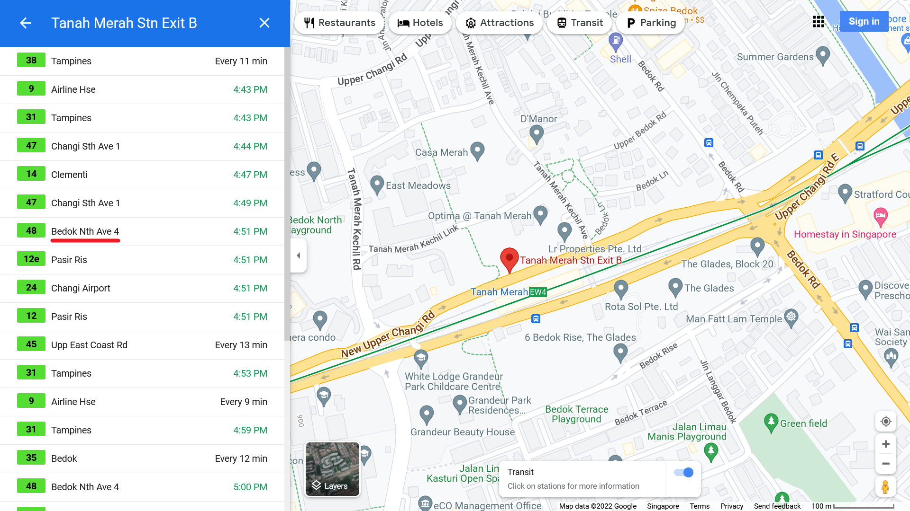

# The Wheels on The Bus 1

> Shortly before Lewis disappeared, he sent me this video. Can you check where he entered the bus?

> Video: https://shorturl.at/rvIY7

> Flag is in the format: ```WH2022{BusStopCode}```

> Note: Visiting the location in the video is out of the scope of this challenge.

Let's examine our only source, the video, for clues.

## Clue 1: Overground MRT


This bus stop is located next to an overground MRT station, narrowing it down to selected stations along the North-South Line and the East-West Line.

## Clue 2: Bus 48 to Buona Vista


This bus stop is served by bus service 48, heading towards Buona Vista terminal.

## Everything is Coming Together

A Google search can help you find all the MRT stations served by bus service 48 (https://landtransportguru.net/bus48).


Considering clue 1, the only overground MRT station is Tanah Merah.


There are two bus stops at Tanah Merah MRT station. While you could manually match them with Google Street View, remember that the bus 48 is heading towards Buona Vista terminal.

|||
|:---:|:---:|

We can now confirm that the bus stop is Tanah Merah Stn Exit A.


With the help of Google Maps, we can find its bus stop code, which is the flag.

**FLAG:** ```WH2022{85099}```