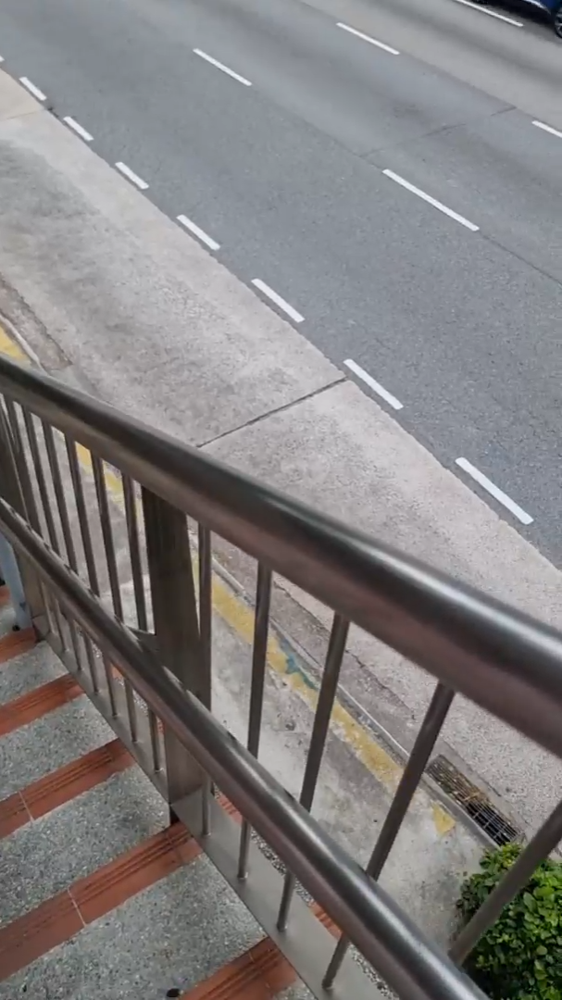

# The Wheels on The Bus 2

> So, we found out that Lewis took bus 48 from Tanah Merah Stn Exit A. One hour later, he sent this. Where was he at the end of the video?

> Video: https://shorturl.at/gorFR

> Flag is in the format: WH2022{PostalCode}

> Note: Visiting the location in the video is out of the scope of this challenge.

Once again, we must look at the video closely for clues. And this time, life is getting difficult...

p.s. On the Google Drive player (and YouTube), you can use the "," and "." keys (for "<" and ">") to move frame by frame, so you can easily pause and search for the precise frame that you want to examine.

<details><summary>## Clue 1: One Hour from Tanah Merah</summary>

> One hour later, he sent this.

We shall first assume that he sent both videos shortly after he filmed each of them, which means that he was on bus 48 for one hour from Tanah Merah.

We can obtain bus travelling times from multiple sources.

### Google Maps

As far as I can tell, I could only obtain bus schedules on Google Maps via the app, not their website.


This narrows down the range to the Farrer Road area.

### TransitLink


With a bit of guess and check, it takes 60 minutes to travel from Tanah Merah Stn Exit A to Opp KK Women & Child Hosp, according to Transitlink

Unfortunately, this widens the range significantly to include over 10 more bus stops, and the entire area around Little India, Newton and Botanic Gardens.

How tragic.

Now, we need to go back to the video to see what we can do.</details>

<details><summary>## Clue 2: Market</summary>


Self-explanatory.</details>

<details><summary>## Clue 3: Overhead Bridge</summary>


Lewis has likely crossed a road on an overhead bridge.

Given that Lewis likely just alighted the bus, we know that he is now opposite the bus stop where he alighted, which effectively eliminates around half of the possible addresses since we know the direction of the bus as well. (Each pair of bus stop on each side of the road usually has the same bus in opposite directions.)</details>

<details><summary>## Clue 4: Four-Lane Road</summary>

|||
|:---:|:---:|

Most roads have only up to 3 lanes, and not many roads have four lanes, so this could help narrow down things a bit.</details>

<details><summary>## Clue 5: Near MRT</summary>


If you look really closely, there is a sign indicating a nearby MRT station too.</details>

<details><summary>## Clue 6: Walking Around the Market</summary>

</details>

**FLAG:** ```WH2022{}```