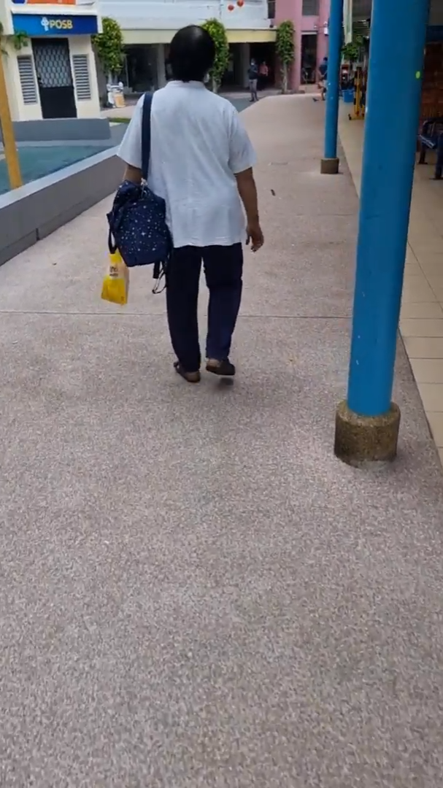
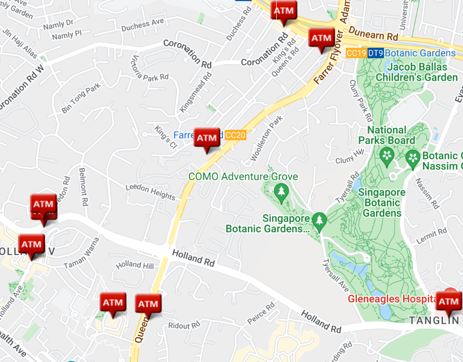

# The Wheels on The Bus 2

> So, we found out that Lewis took bus 48 from Tanah Merah Stn Exit A. One hour later, he sent this. Where was he at the end of the video?

> Video: https://shorturl.at/gorFR

> Flag is in the format: ```WH2022{PostalCode}```

> Note: Visiting the location in the video is out of the scope of this challenge.

Once again, we must look at the video closely for clues (unless you plan to go to Tanah Merah and take the bus for one hour which is *not advisable* to say the least). And this time, life is getting difficult...

(Of course, unless you recognised the location at any point in the video, then please feel free to save your time.)

p.s. On the Google Drive player (and YouTube), you can use the "," and "." keys (for "<" and ">") to move frame by frame, so you can easily pause and search for the precise frame that you want to examine.

<details><summary><h2>Clue 1: One Hour from Tanah Merah</h2></summary>

> One hour later, he sent this.

We shall first assume that he sent both videos shortly after he filmed each of them, which means that he was on bus 48 for one hour from Tanah Merah.

We can obtain bus travelling times from multiple sources.

### Google Maps

As far as I can tell, I could only obtain bus schedules on Google Maps via the app, not their website.


This narrows down the range to the Farrer Road area.

### TransitLink


With a bit of guess and check, it takes 60 minutes to travel from Tanah Merah Stn Exit A to Opp KK Women & Child Hosp, according to Transitlink

Unfortunately, this widens the range significantly to include over 10 more bus stops, and the areas after Little India, and around Newton and Botanic Gardens.

How tragic.

Now, we need to go back to the video to see what we can do.</details>

<details><summary><h2>Clue 2: Market</h2></summary>


Most markets are managed by NEA. You can find a list and a map on NEA's website (https://www.nea.gov.sg/our-services/hawker-management/overview).</details>

<details><summary><h2>Clue 3: Overhead Bridge</h2></summary>


Lewis has likely crossed a road on an overhead bridge.

Given that Lewis likely just alighted the bus, we know that he is now opposite the bus stop where he alighted.

This eliminates around half of the possible addresses, since we know the direction of the bus as well. (Each pair of bus stop on each side of the road usually has the same bus in opposite directions.)</details>

<details><summary><h2>Clue 4: Four-Lane Road</h2></summary>

|||
|:---:|:---:|

Most roads have only up to 3 lanes, and not many roads have four lanes, so this could help narrow down things a bit.</details>

<details><summary><h2>Clue 5: Near MRT</h2></summary>


If you look really closely, there is a sign indicating a nearby MRT station too.</details>

<details><summary><h2>Clue 6: Walking Around the Market</h2></summary>

|||||||
|:---:|:---:|:---:|:---:|:---:|:---:|

Lewis walks around the market towards an HDB lift lobby.


Most probably the HDB block in the background here.</details>

<details><summary><h2>Clue 7: POSB ATM</h2></summary>


While there are too many POSB ATMs for this to be meaningful by itself, it could come in useful.</details>

## Capturing the Postal Code

There are many ways to use the clues we have to find the location. And there's surely many other clues which I did not notice.

I would first use clues 1 and 5 to narrow it down to bus stops near MRT stations along bus service 48 (Little India, Newton, Stevens, Botanic Gardens, Farrer Road, Holland Village).


Using clue 2, we could look at the map of markets within the same area.


With clue 3, we can eliminate the markets which are on the same side of the road as bus 48 towards Buona Vista (remember, Singapore drives on the left!).

We are now left with 3 markets, one each at Botanic Gardens, Farrer Road and Holland Village.

Now, I use clue 7 and match the 3 markets to a map of POSB ATMs.

|||
|:---:|:---:|

I marked out the 3 markets with purple crosses. The Holland Village market may seem close, but they aren't even on the same road if you look carefully.

The market is Empress Market on Farrer Road!


We can double check using Google Street View.


But remember, the final destination refers to this HDB block, which we also saw at the start of the video.

|||
|:---:|:---:|

Now, we just need some simple Google Map-ing.


**FLAG:** ```WH2022{260008}```

<details><summary>Also I actually did it this way...</summary>


I was at a loss at first but...


...hm this looks familiar. Is it Farrer Road?


Ohhhhh it is Farrer Road.

The End.</details>