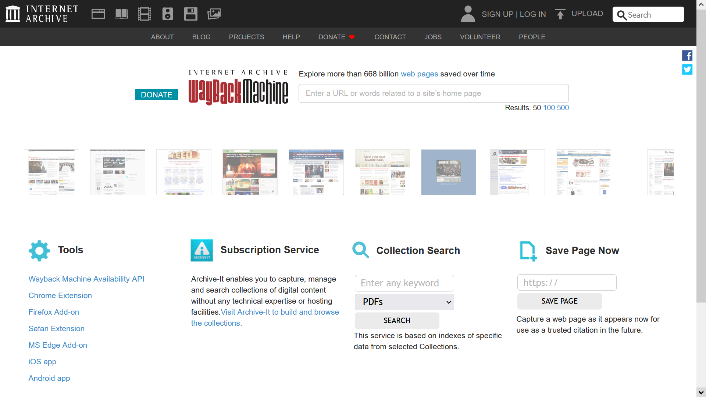
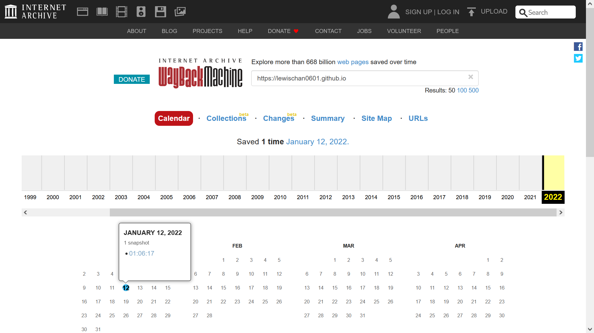
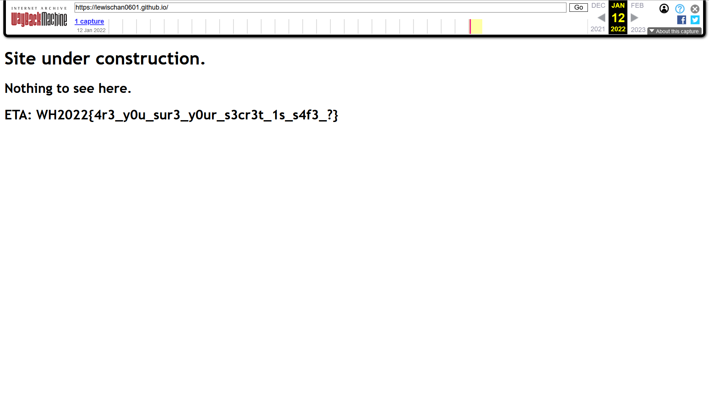

# Bad Historical Design

> So, Lewis used to say to me that he had a website. I doubt there is anything there, but let's check it out.

> Site Link: https://lewischan0601.github.io

## Introduction

> I doubt there is anything there

Doubt.


Can't be right? I'm a haccker, I know how to right click > inspect.


Oh no.

## Bad **Historical** Design

**Historical.**

What's so historical about a website? Is there a history of the internet?

Of course there is.



Pop over to Wayback Machine (https://web.archive.org) and check if Lewis' website has any **history**.



Ooh



**FLAG:** ```WH2022{4r3_y0u_sur3_y0ur_s3cr3t_1s_s4f3_?}```