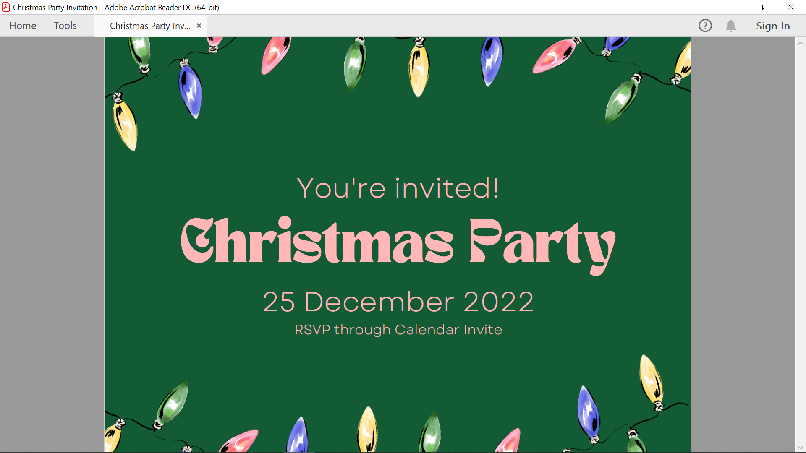
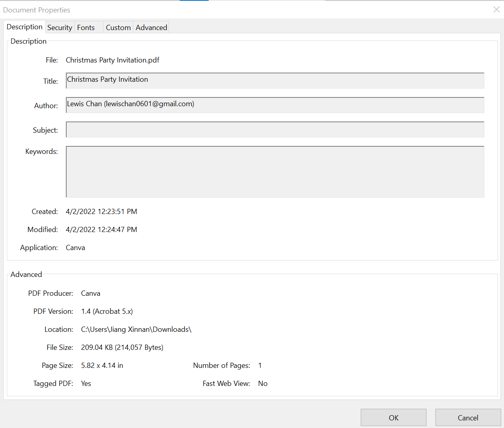
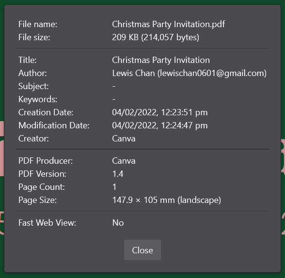
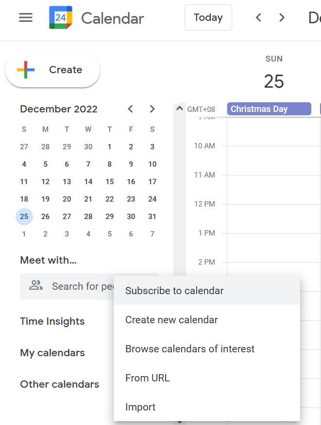
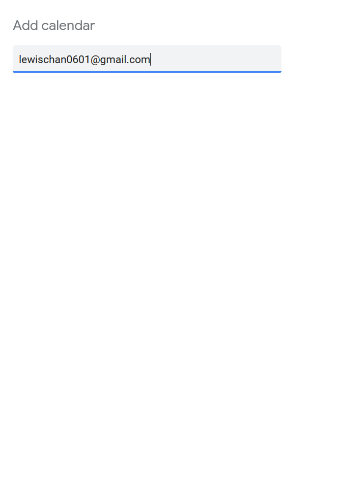
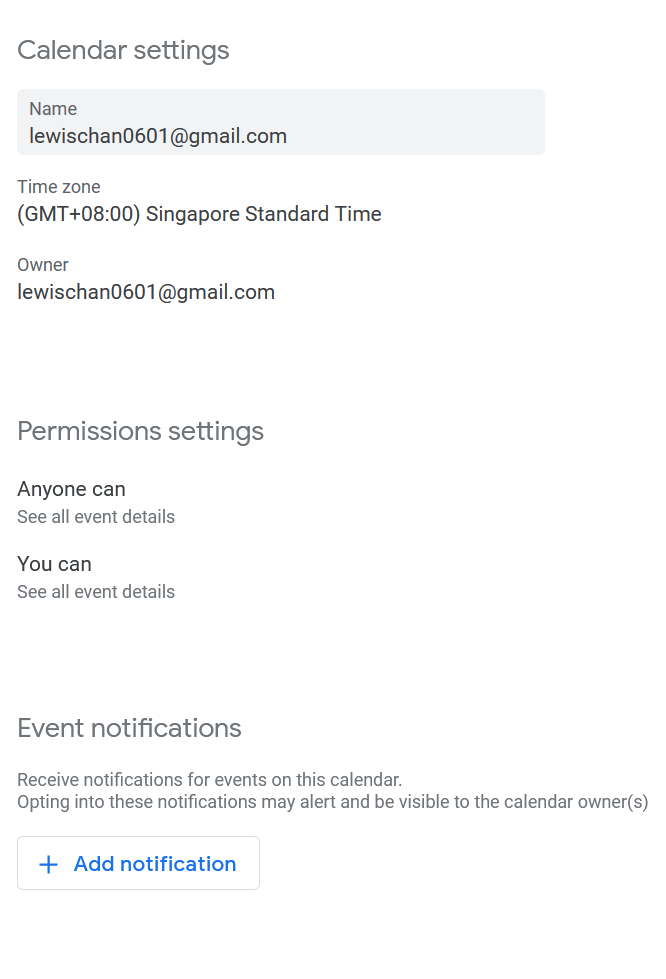
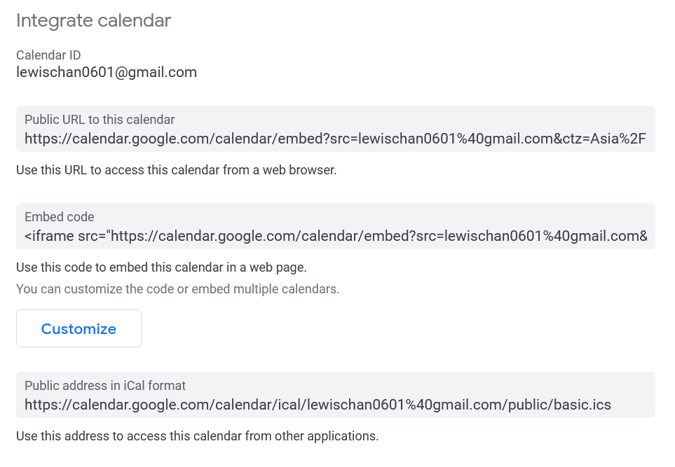
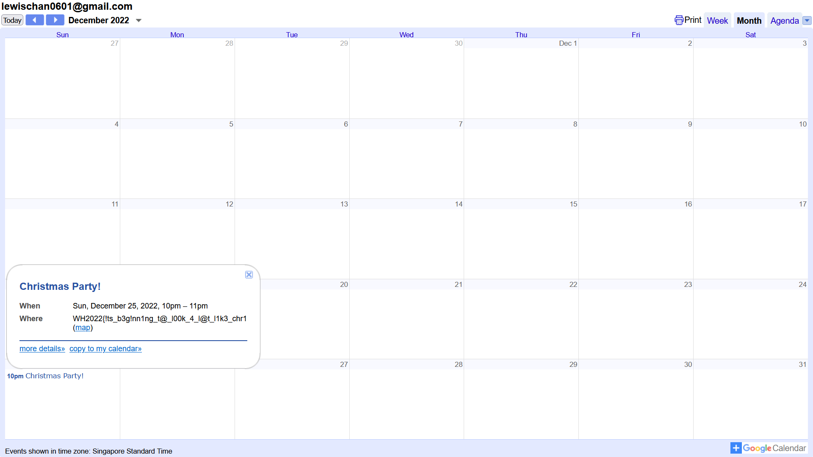
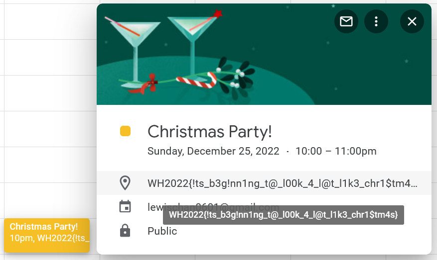

# This Christmas

> So, Lewis had this habit of inviting people to next year's Christmas party at the start of every year. However, this year he didn't provide us with any information. All he provides us is this card. Maybe there's something there?

> Card: https://shorturl.at/oyAJ6



Nothing weird. That's bad for us... Time to dig deeper.

|||
|:---:|:---:|

Nice, an email ```lewischan0601@gmail.com```. You can find the properties of the PDF on most PDF readers, including Adobe Acrobat Reader and Firefox.

## Christmas Party!

> You're invited!

Oh, what an honour. How could I bear to turn Lewis down?

> RSVP through Calendar Invite

But how? Lewis, you didn't give me a link or anything...

Maybe his Gmail links to a Google Calendar? But how do I find his Google Calendar? Google search didn't give me anything.



Maybe I could subscribe to his calendar?

||
|
|:---:|:---:|

Scroll down a bit...



His calendar can be accessed via https://calendar.google.com/calendar/embed?src=lewischan0601%40gmail.com&ctz=Asia%2FSingapore.



Lewis, I AM COMING FOR YOUR PARTY!

Also interesting location there...



See you on Christmas at 10!

**FLAG:** ```WH2022{!ts_b3g!nn1ng_t@_l00k_4_l@t_l1k3_chr1$tm4s}```