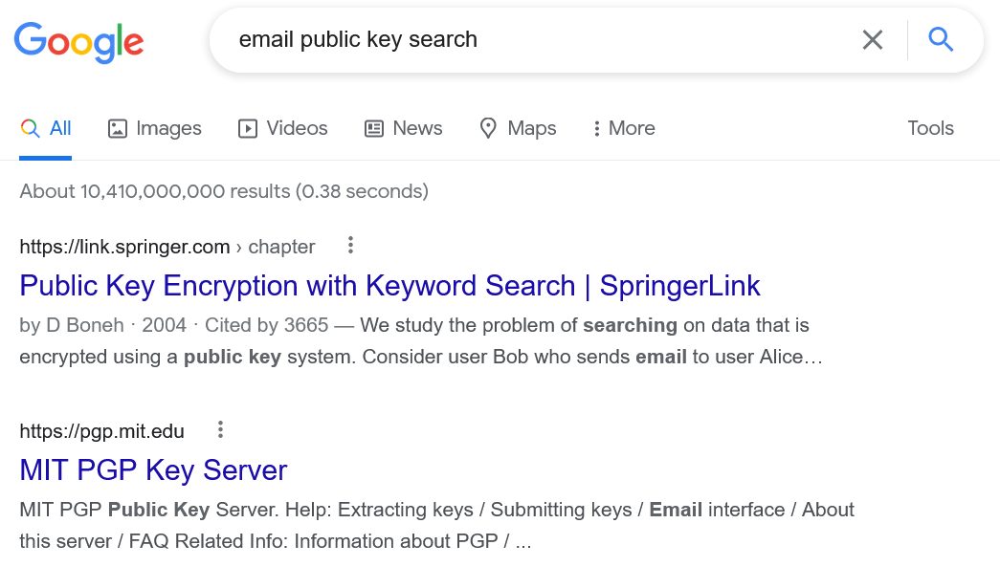
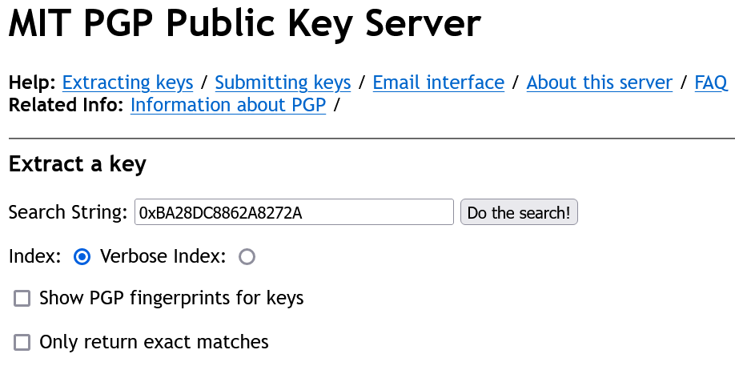
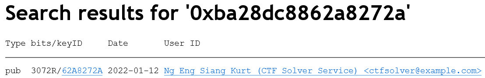

# The War of The Worlds 1 - Shell Company

> Anyway, before Lewis disappeared, he got alerted that some company is providing CTFSolver-as-a-Service. I mean, what kind of cruel human being would take away all the F(un) from CTF, and we surely don't want anyone to be using their service for our upcoming CTF.

> Check this out: https://github.com/CTFSolverService

> In any case, find out who owns the company. Maybe they have something to do with Lewis's disappearance.

> Flag is in the format: ```WH2022{FullNameWithNoSpaceAndInitialCaps}```


## Key?

Hint on Discord:

> For The War of The Worlds 1, try to consider what is this "key" and how can you find out who is behind this "key". Is there a "key" that can be used in relation to contacting someone?

A key is usually used to lock stuff.

> Secure your communication

This evil service doesn't want anyone to peek in on their shady business. Perhaps they use a key to lock their communications somehow?

But why would they release their key to the public?

## [Asymmetric Cryptography](https://en.wikipedia.org/wiki/Public-key_cryptography)

Asymmetric cryptography works with a pair of keys - one public and one private.

A recipient would have both a public key and a private key.

The sender must use the recipient's public key to encrypt the message, which only the private key can decrypt.

While both keys are mathematically related, it is almost impossible to derive a private key from the public key (for now), which is why it can be public.

This is likely to be what evil CTF Solver Service is using.

## Dealing with The Devil

One of the most common applications of public key cryptography is for email encryption.

While we cannot crack the evil service's private key with its public key, we might be able to use it to link back to its email address. We are trying to find their owner after all.

A commonly used encryption protocol for emails is PGP (Pretty Good Privacy). However, even if you didn't know that, searching the right things on Google would easily give you the desired result too.



Now simply search the key...




**FLAG:** ```WH2022{NgEngSiangKurt}```