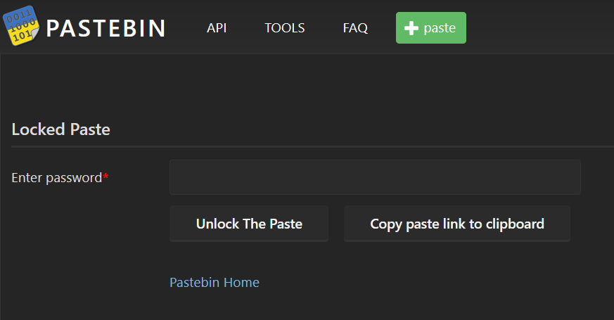
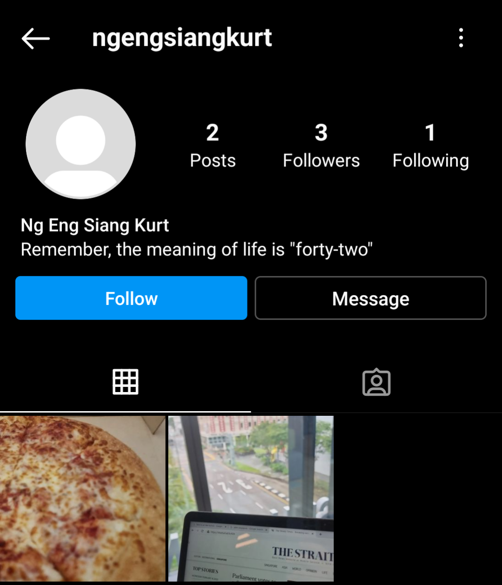
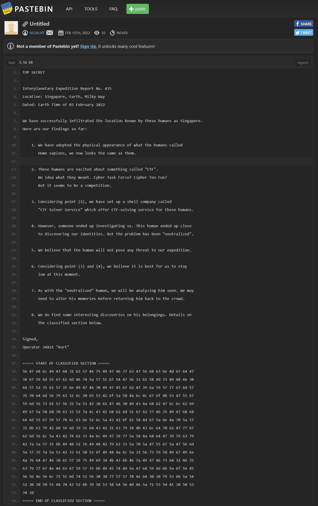

# The War of The Worlds 2 - Humans or ET

> Hmm, I think it may be worth taking a deeper look at this Kurt person. See if they have something to do with Lewis' disappearance. Be careful though, make sure that he doesn't know that you are investigating him.

> Maybe this "Ng Eng Siang Kurt" has a social media or something?

## Social Media Platforms

Suppose you have absolutely no idea what are social media platforms (if you reached here you probably should know better but). Fret not, because Google is your friend!


After searching the different platforms, we would have found something on Instagram.


First, stalk his posts!

|||
|:---:|:---:|

That pizza is intensifying my hunger but that URL is raising my eyebrows. Ignoring the fact that Kurt just searched "how to act like human", I don't think that The Straits Times changed their URL to https://shorturl.at/krA04.

Being the overly curious creatures we are, let's go explore!

## QR Code Part 1


Well that's useless for now. Keep it in your backpack and retreat.

## Social Connections

||||
|:---:|:---:|:---:|

We've run out of things to look for on Kurt's Instagram. But who's this not_alien_123?


Off to TikTok we go then.

## Tik Tok Tik Tok


Perfect. But stop making me hungry! But I'm gonna look at that cake anyway.


OH WHAT.

p.s. If you are having trouble smashing your print screen key when the QR code flashes, you could right click and download the video on its website, so you can find the perfect timing to pause and savour the delicious QR code.


## PhotoshopBattles

Use your favourite photo editor, such as Microsoft Paint, to assemble the two parts of the QR code.


Note that both parts contain the same section in the middle, so try to overlap the duplicated parts such that the original QR code is obtained.


After some professional editing work, you should be able to get this QR code which links to https://pastebin.com/WW190H2W. (Use either your phone to scan it or an online tool such as [CyberChef](https://gchq.github.io/CyberChef/#recipe=Parse_QR_Code(false)) to read the image.)

## Pastebin



*Noooooooo.* Maybe we can find it somewhere back in Instagram or TikTok. Maybe in his pizza?



> Remember, the meaning of life is "forty-two"

Yes sir. Perhaps the meaning of password too? No harm trying anything you find.

It works!



Whoa, after searching for how to be human and following not_alien_123, this comes as a huge shock to everyone.

<details><summary><h3>Full Text</h3></summary>
```
TOP SECRET
 
Interplanetary Expedition Report No. 435
Location: Singapore, Earth, Milky Way
Dated: Earth Time of 03 February 2022
 
We have successfully infiltrated the location known by these humans as Singapore.
Here are our findings so far:
 
    1. We have adopted the physical appearance of what the humans called
       Homo sapiens, we now looks the same as them.
 
    2. These humans are excited about something called "CTF".
       No idea what they meant. Cyber Task Force? Cipher Too Fun?
       But it seems to be a competition.
 
    3. Considering point (1), we have set up a shell company called
       "CTF Solver Service" which offer CTF-solving service for these humans.
 
    4. However, someone ended up investigating us. This human ended up close
       to discovering our identities. But the problem has been "neutralized".
 
    5. We believe that the human will not pose any threat to our expedition.
 
    6. Considering point (3) and (4), we believe it is best for us to stay
       low at this moment.
 
    7. As with the "neutralized" human, we will be analyzing him soon. We may
       need to alter his memories before returning him back to the crowd.
 
    8. We do find some interesting discoveries on his belongings. Details on
       the classified section below.
 
Signed,
Operator 34X21 "Kurt"
 
===== START OF CLASSIFIED SECTION =====
56 47 68 6c 49 47 68 31 62 57 46 75 49 47 46 77 63 47 56 68 63 6e 4d 67 64 47 
38 67 59 6d 55 67 62 6d 46 74 5a 57 51 67 54 47 56 33 61 58 4d 73 49 48 4e 30 
64 57 52 35 61 57 35 6e 49 47 46 30 49 47 45 67 62 47 39 6a 59 57 77 67 64 57 
35 70 64 6d 56 79 63 32 6c 30 65 53 42 6f 5a 58 4a 6c 4c 67 6f 4b 53 47 55 67 
59 6d 56 73 61 57 56 32 5a 53 42 30 61 47 46 30 49 43 4a 68 62 47 6c 6c 62 69 
49 67 5a 58 68 70 63 33 52 7a 4c 43 42 68 62 6d 51 67 62 57 46 35 49 47 68 68 
64 6d 55 67 59 57 78 6c 63 6e 52 6c 5a 43 42 6f 61 58 4d 67 5a 6e 4a 70 5a 57 
35 6b 63 79 42 68 59 6d 39 31 64 43 42 31 63 79 34 4b 43 6c 64 70 62 47 77 67 
62 6d 56 6c 5a 43 42 74 62 33 4a 6c 49 47 39 77 5a 58 4a 68 64 47 39 79 63 79 
42 7a 5a 57 35 6b 49 48 52 76 49 48 42 79 62 33 5a 70 5a 47 55 67 5a 47 56 6d 
5a 57 35 7a 5a 53 42 33 61 58 52 6f 49 48 4a 6c 5a 33 56 73 59 58 49 67 49 6e 
4a 76 64 47 46 30 61 57 39 75 49 69 34 4b 43 6b 46 7a 49 47 46 73 64 32 46 35 
63 79 77 67 4e 44 63 67 59 57 35 6b 49 45 74 49 5a 47 68 59 4d 6b 5a 6f 56 45 
56 56 4e 56 6c 71 51 6d 74 52 56 30 30 77 57 57 78 4e 64 30 30 79 53 6b 5a 54 
52 30 70 70 55 48 70 43 52 6b 39 58 53 58 64 56 4d 46 5a 71 55 54 41 30 50 53 
34 3d
===== END OF CLASSIFIED SECTION =====
```
</details>

**FLAG:** ```WH2022{}```