# The War of The Worlds 2 - Humans or ET

> Hmm, I think it may be worth taking a deeper look at this Kurt person. See if they have something to do with Lewis' disappearance. Be careful though, make sure that he doesn't know that you are investigating him.

> Maybe this "Ng Eng Siang Kurt" has a social media or something?

## Social Media Platforms

Suppose you have absolutely no idea what are social media platforms (if you reached here you really should know better but). Fret not, because Google is your friend!

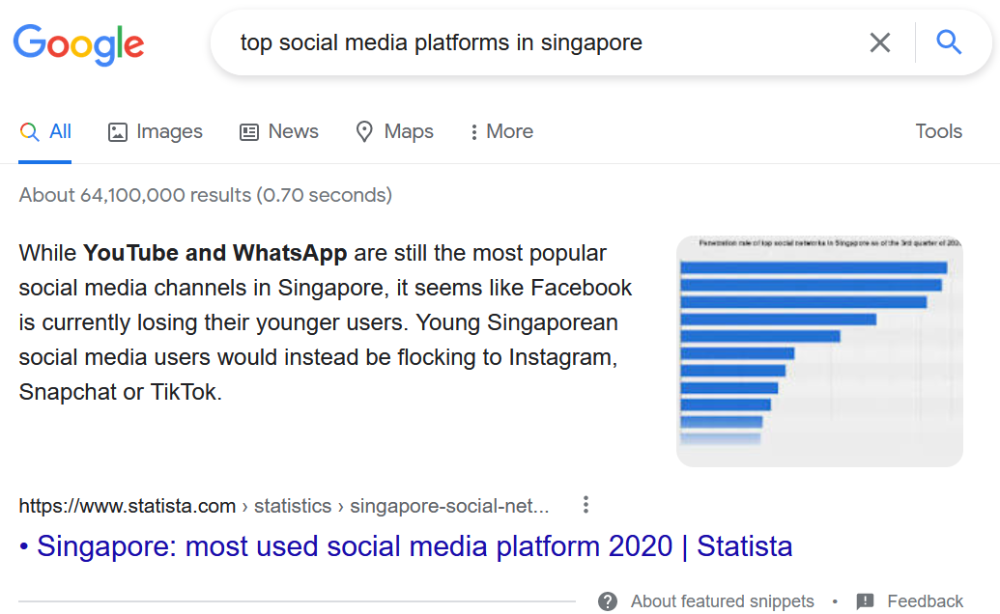

After searching the different platforms, we would have found something on Instagram.

|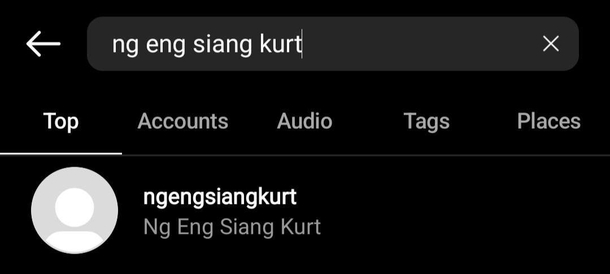|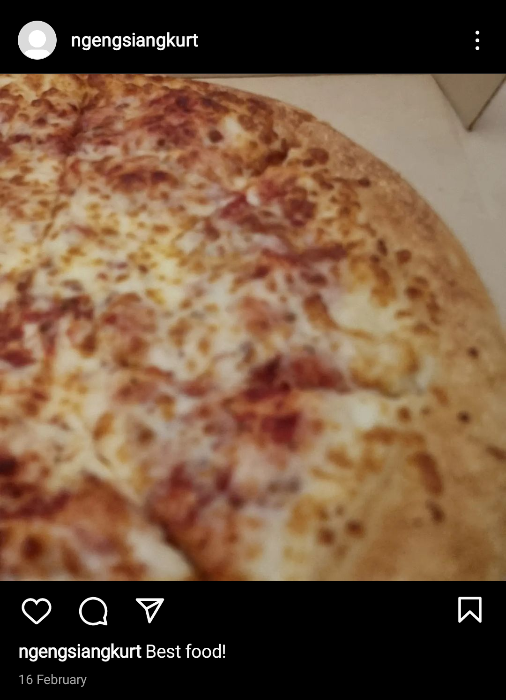|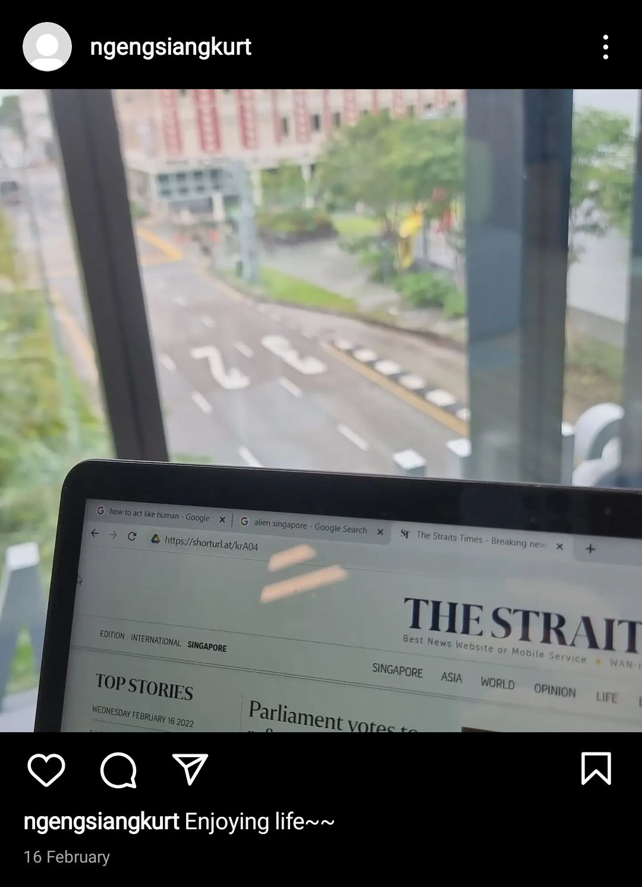|
|:---:|:---:|

That pizza is intensifying my hunger but that URL is raising my eyebrows. Ignoring the fact that Kurt just searched "how to act like human", I don't think that The Straits Times changed their URL to https://shorturl.at/krA04.

Being the overly curious creatures we are, let's go explore!

## QR Code Part 1

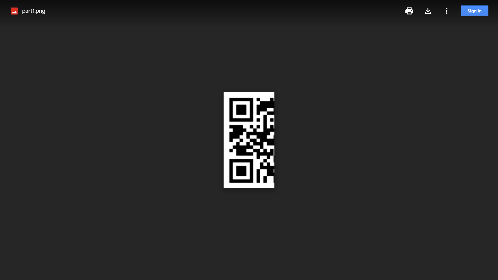

Well that's useless for now. Keep it in your backpack and retreat.

## Social Connections

|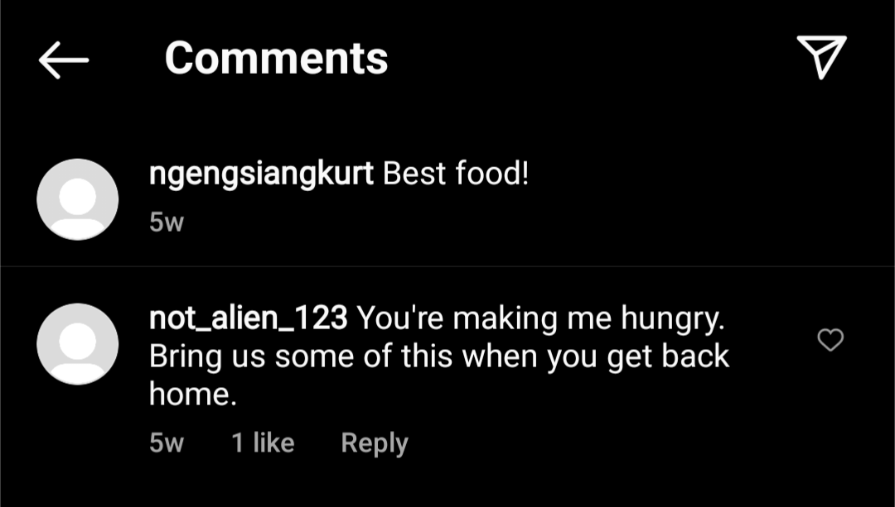|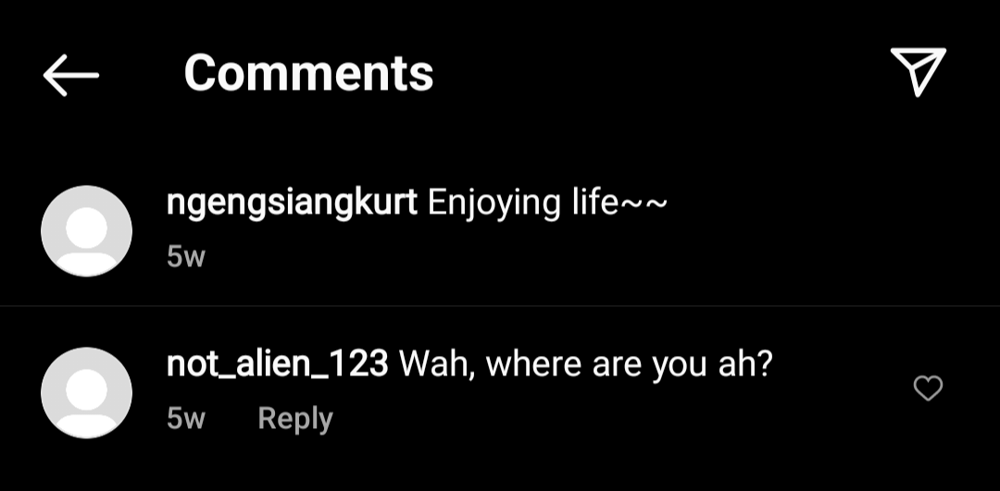|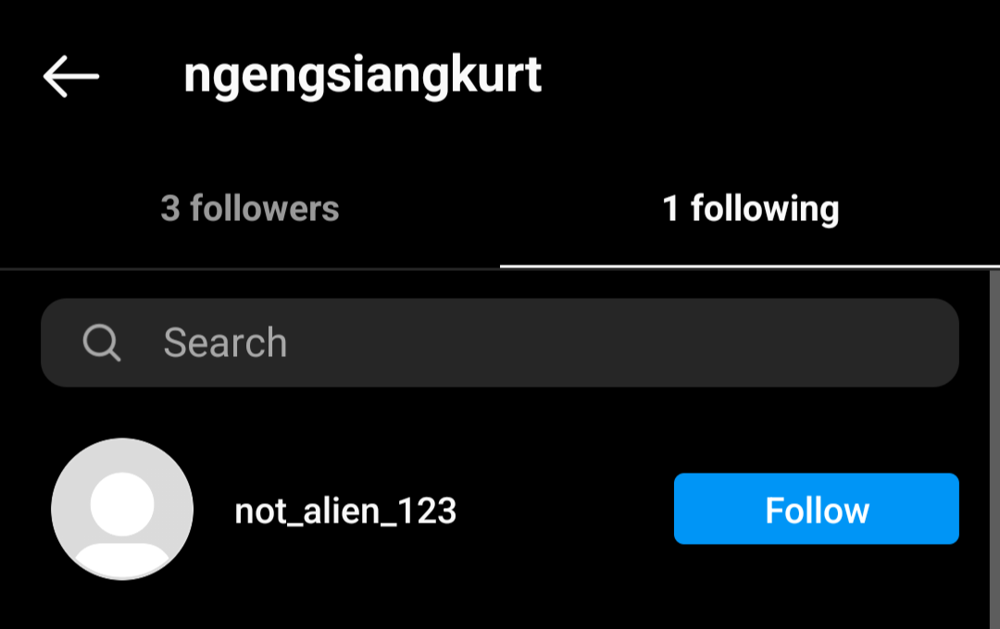|
|:---:|:---:|:---:|

We've run out of things to look for on Kurt's Instagram. But who's this not_alien_123?

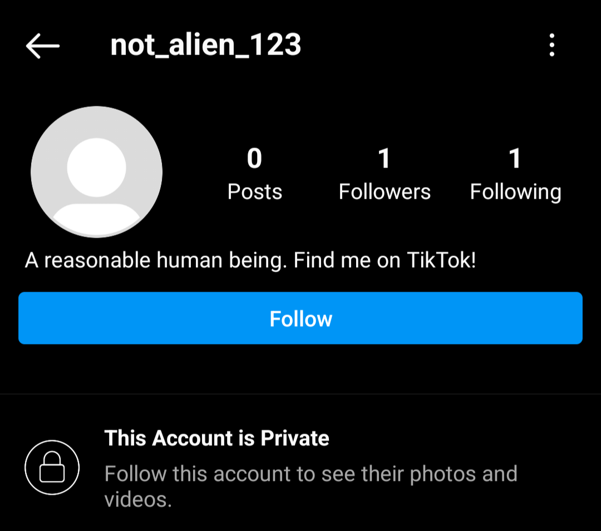

Off to TikTok we go then.

## Tik Tok Tik Tok

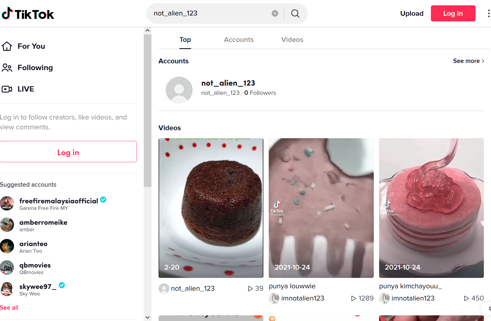

Perfect. But stop making me hungry! But I'm gonna look at that cake anyway.

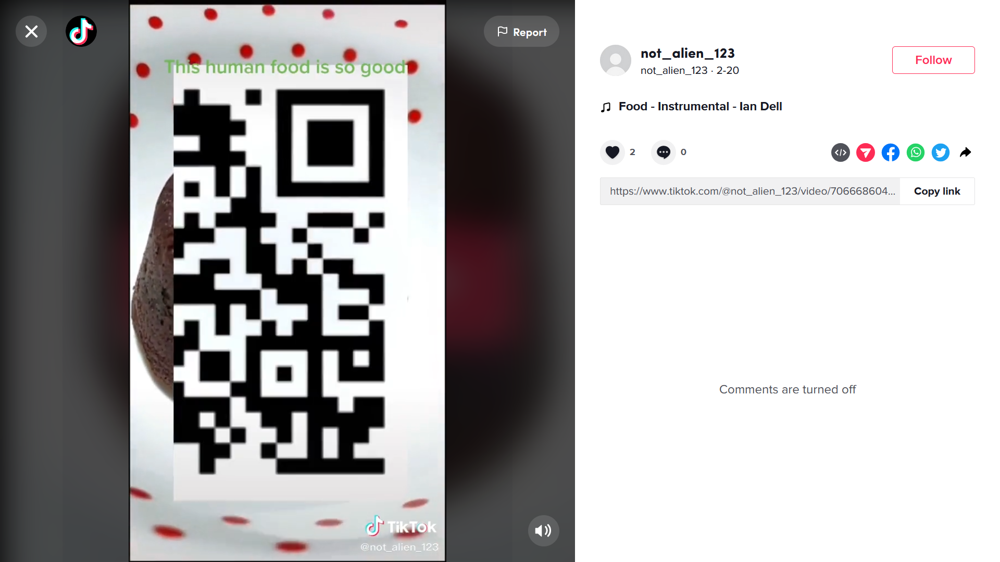

OH WHAT.

p.s. If you are having trouble smashing your print screen key when the QR code flashes, you could right click and download the video on its website, so you can find the perfect timing to pause and savour the delicious QR code.

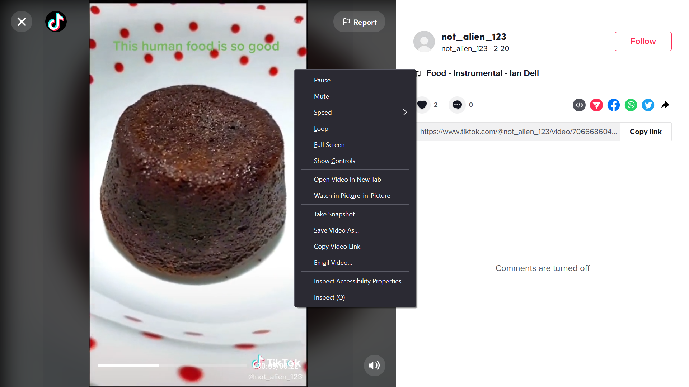

## PhotoshopBattles

Use your favourite photo editor, such as Microsoft Paint, to assemble the two parts of the QR code.

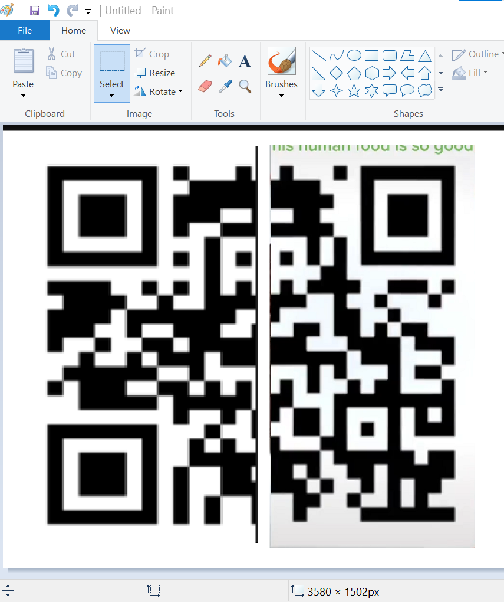

Note that both parts contain the same section in the middle, so try to overlap the duplicated parts such that the original QR code is obtained.

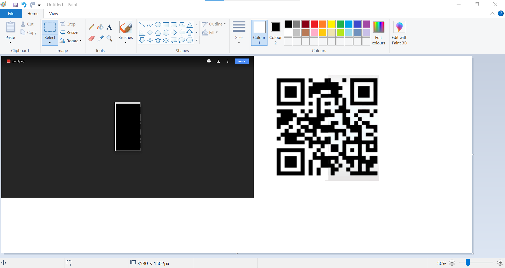

After some professional editing work, you should be able to get this QR code which links to https://pastebin.com/WW190H2W. (Use either your phone to scan it or an online tool such as [CyberChef](https://gchq.github.io/CyberChef/#recipe=Parse_QR_Code(false)) to read the image)

**FLAG:** ```WH2022{}```